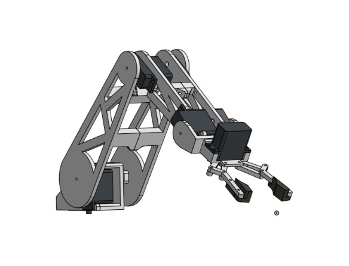

# My 5 DOF Desktop Robotic Arm
Hack Club Stasis Project

this project is a 6 DOF (degree of freedom) robotic arm designed to pick up desk stuff, for example a can, a pencil and so much more. The arm is primarily 3d printed and powered by high tourque servos controlled over a web interface running on an esp32
## The Goal:
    i want a cool arm
    i want it to be able to pick up a can of monster
    i wanna get deeper into the engineering process

## Features / Cool things:
    5 Degrees of freedom (thats more than 4!)
    fully 3d printed in PLA with optional TPU parts
    cool nicley articulated wrist
    Funky 4-Bar gripper (its designed for a monster can)
    wireless control over esp32

## The Degrees of fredom
    base rotation
    shoulder joint
    elbow joint
    wrist joint
    gripper open/close
*(thats a lot of freedom!)*

## Hardware/BOM
    ESP32 MicroController With Wirless
    REV Robotics Servo Power Module
    2 x 40kg servos (shoulder, elbow)
    4 x 20kg servos (everything else (base, wrist, gripper))
    PLA printed parts
    TPU gripper and base (optional)
    M3 Bolts and heat-set inserts

## CAD
    All cad was done in **Onshape** 
    Onshape Link:
[Click Me!](https://cad.onshape.com/documents/f8b7ed66decb5e186765f33e/w/57c4c996fe0e253bf14dcaf8/e/4cd8dd7666434088b9f34eb3?renderMode=0&uiState=69ad3a974c0b245ce06990f0)
# But.. What problem does it solve/ why should I be making it

## problem 1:

I don’t have a robotic arm, Thats a problem in itself

## problem 2:

Im not cool enough, have you ever seen someone who built their own robotic arm that isn’t cool?

## problem 3:

I only have 2 hands, why would I let go of my keyboard and mouse for more than 3 seconds, when instead I can spend hours on end designing something to do it for me
